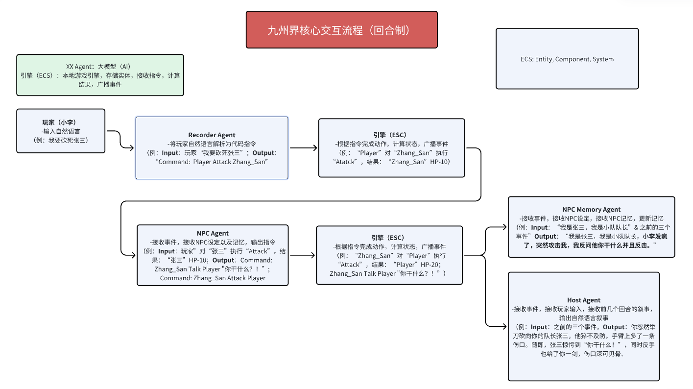

# Jiuzhoujie (九州界) - GenAI Multi-Agent Engine

> **Project Status:** Active Development (Closed Source Core)
> **Role:** Founder & Product Lead
> **Tech Stack:** Python, Entity-Component-System (ECS), LLM Agents (Host/Recorder), Prompt Engineering.

## 📖 Project Overview

**Jiuzhoujie** is an AI-native text adventure platform that decouples narrative generation from game state management. Unlike traditional wrapper-based AI games, it utilizes a custom **Entity-Component-System (ECS)** architecture to ensure logical consistency, memory persistence, and hallucination control.

Since its launch, the platform has acquired **1,100+ active users** with an average session time of **61 minutes**.

🔗 **Demo Video:** 【Unable to tolerate the amnesia-prone AI, I created a cultivation world where nothing is ever forgotten?!】 https://www.bilibili.com/video/BV1qVaFzxEP1/?share_source=copy_web&vd_source=c72d2dd6d4df0ff72b2e28ee1ae3d5ab

## 🏗 System Architecture

The core innovation of Jiuzhoujie lies in its **Dual-Agent Architecture** combined with a deterministic ECS state machine. This design addresses the common "context window" and "logic hallucination" problems found in LLM-based games.

### Key Components

1.  **ECS Engine (The "Law"):**
    *   Manages the deterministic world state (Health, Inventory, Location).
    *   Processes JSON commands parsed from AI output.
    *   **Reasoning:** Ensures that game rules (e.g., "Cannot open a locked door without a key") are enforced by code, not by the LLM.

2.  **Recorder Agent (The "Translator"):**
    *   **Input:** Natural language from the player (e.g., "I want to chop down the tree").
    *   **Output:** Structured JSON Command (e.g., `{"command": "ATTACK", "target": "tree", "tool": "axe"}`).

3.  **NPC & Host Agents (The "Narrator"):**
    *   **Memory Agent:** Reads localized events and updates specific NPC memory vectors.
    *   **Host Agent:** Generates immersive narrative based strictly on the `Events` output by the ECS engine, preventing narrative contradictions.

## 🚀 Key Features

*   **Deterministic State Management:** Game logic is handled by Python systems, ensuring 100% rule adherence.
*   **Context-Aware Memory:** Dynamic retrieval of relevant memories prevents context window overflow.
*   **Multi-Agent Coordination:** NPCs operate as independent agents with their own goals and "Squad" behaviors.

## 📂 Documentation

*This repository contains the system design documentation. The core source code is proprietary.*

*   [Project Technical Overview](./PROJECT_OVERVIEW.md) (Detailed Architecture Breakdown)

## 📬 Contact

**Rick Han** - Founder & Product Manager
*   Email: rh758@cornell.edu
*   LinkedIn: [linkedin.com/in/rh758](https://www.linkedin.com/in/rh758/)
